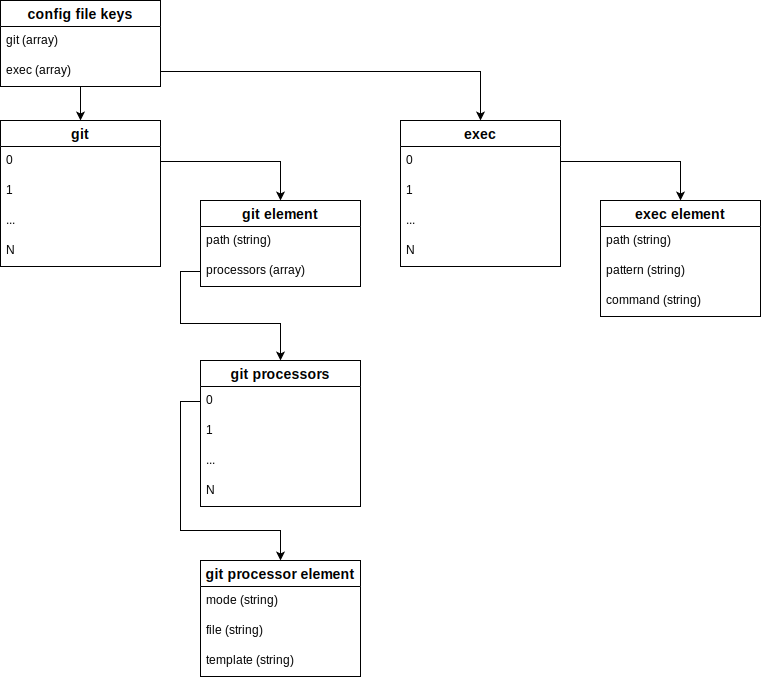

# hugo-preproc

Helper for Hugo to provide for pre-processing of files.

## Purpose

Provide for a flexible pre-processor for Hugo, since we cannot as a community appear to be able to get certain filetypes supported for external handlers/processors in the core Hugo code.

Intended to assist with any sort of pre-processing desired for publishing files, such as:

* Diagrams converted to SVG.
  * Mermaid
  * Draw.io
  * Graphviz
  * etc.

## Use

A configuration file is used to define processing.  By default, the config filename is `.hugo-preproc.yaml` (or `.toml`, or `.json`).

You can specify a config file on command line with the `-c`/`--config` option.

Execute the command and processing occurs based on the configuration.

## Configuration Syntax

The file has two primary keys: `git` and `processors`, such as this example:

``` yaml
git:
  - path: path/to/repo
    processors:
      - mode: head | each | all
        file: path/to/output/file1
        template: |
          Entry {{ .<field> }}
  - path: path/to/repo
    processors:
      - mode: head | each | all
        file: path/to/output/{{ .Commit.Hash }}
        template: "Entry {{ .<field> }}"
exec:
  - path: path/to/top/directory
    pattern: "*.md"
    command: echo {{ . }}
```

The `git` key  is an array object, with each array element defined as follows:

* `path` - Defines the path to the git repo (default: ".")
* `processors` - Array of git log handlers.
  * `mode` - Values of `head` (only the head commit), `each` (each log entry passed through the processor, consecutively), or `all` (all entries passed through the processor).
  * `file` - The file to output; processed as a template.
  * `template` - The template through which the git log entry/entries will be processed and then written to `file`.

The `exec` key is an array object, with each array element defined as follows:

* `path` - The top-level path that will be walked and scanned for matching filenames.
* `pattern` - The pattern used to match the filenames while walking the `path` contents recursively.
* `command` - The command to run on matching files; this value is processed as a Go template.

The array entries will be executed serially, in the order in which they are defined.



## Go Templates

We are using Go Templates to process the `file` and `template` keys in each `git` handler, as well as the `command` key in each `processors` object.

Other than standard Go Template functions, we also add:

* `fields` - `structs.Names`
  * Will return an array of strings of the field names of the input.
  * Can be used to inspect input object fields.
* `replace` - `strings.Replace`
  * Use: `{{replace <input> <search> <replace> <n>}}`
  * Example:
    * Matched name: `example.drawio`
    * `command`: `draw.io --export --output {{replace . ".md" ".svg" -1}} --format svg {{.}}`
    * Template output used for `exec`: `draw.io --export --output example.svg --format svg example.drawio`
* `split` - `strings.Split`
  * Use: `{{split <input> <separator>}}`
* `trimsuffix` - `strings.TrimSuffix`
  * Use: `{{trimsuffix <input> <trim_string>}}`

Other template functions can be added or mapped in as this codebase evolves.

## Go Template Input

We provide the following input for the configured handlers.

* `git` handlers
  * `head` and `each`

    ``` go
    . {
      Commit {
        Hash string
        Author string
        Committer string
        Message string
        TreeHash string
        ParentHashes []string
        PGPSignature string
      }
      Stats []string
    }
    ```

  * `all`

    ``` go
    . {
      // Array of Commits
      Commits []{
        Commit {
          Hash         string   // Hash of the commit object.
          Author       string   // Author is the original author of the commit.
          Committer    string   // Committer is the one performing the commit,
                                // might be different from Author.
          Message      string   // Message is the commit message, contains arbitrary text.
          TreeHash     string   // TreeHash is the hash of the root tree of the commit.
          ParentHashes []string // ParentHashes are the hashes of the parent commits of the commit.
          PGPSignature string   // PGPSignature is the PGP signature of the commit.
        }
        Stats []string
      }
      // Head Commit
      Head {
        Commit {
          Hash         string
          Author       string
          Committer    string
          Message      string
          TreeHash     string
          ParentHashes []string
          PGPSignature string
        }
        Stats []string
      }
    }
    ```
* `exec` handlers

  ``` go
  . string
  ```
